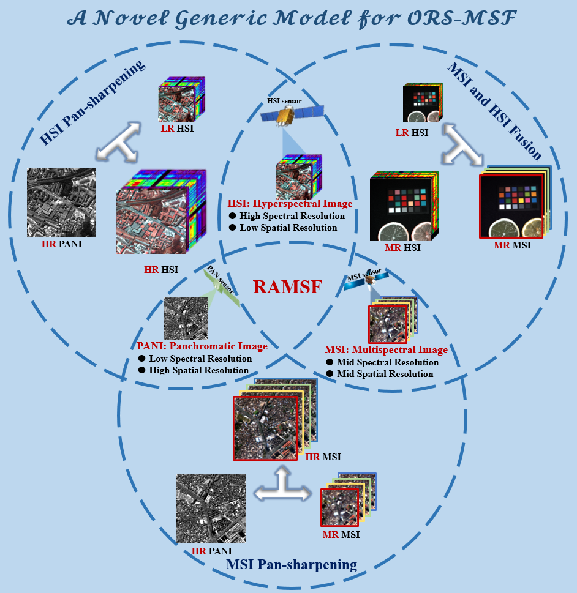
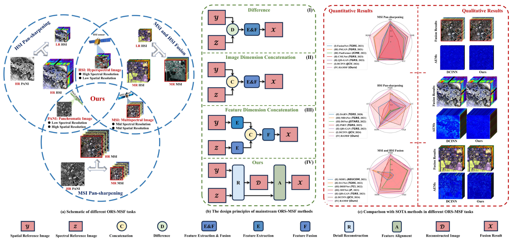
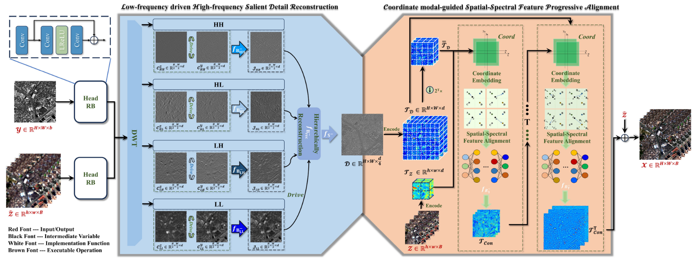
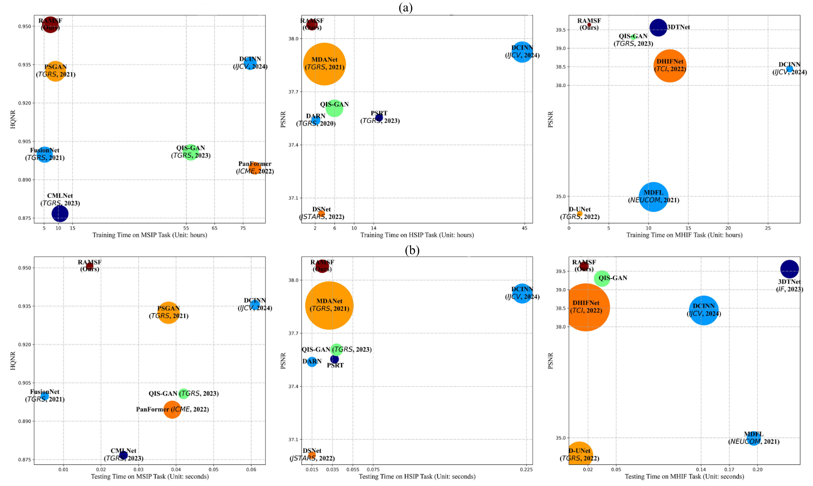

<div align="center">


# RAMSF
**RAMSF: A Novel Generic Framework for  Optical Remote Sensing Multimodal  Spatial–Spectral Fusion.**

______________________________________________________________________

<p align="center">
<a href="https://ieeexplore.ieee.org/document/10934049/">Paper</a> •
<a href="#Abstract">Abstract</a> •
<a href="#Method">Method</a> •
<a href="#Dependencies">Installation</a> •
<a href="#Dataset">Dataset</a> •
<a href="#Training">Training</a> •
<a href="#Testing">Testing</a> •
<a href="#Pre-trained-models-and-results">Weights</a> •
<a href="#Citation">Citation</a><br>
</p>

[]()
<br>


</div>

______________________________________________________________________

### Abstract

Optical remote sensing (ORS) multimodal spatial-spectral fusion (MSF) aims to obtain high-resolution images containing fine-grained spatial details and high-fidelity spectral information, which are crucial for downstream tasks and real-world applications. Existing methods can yield promising outcomes in specific fusion scenarios. However, due to the coarse representation of spatial details and the imprecise alignment of spatial-spectral features, the majority of methods encounter difficulties in balancing spatial and spectral preservation. This imbalance tends to cause distortion in the fused image, rendering these task-specific methods less adaptable and more challenging to apply simultaneously to different ORS-MSF tasks. To address this gap, this article introduces a generic framework that focuses on generalization and practical applicability, rather than solely optimizing the performance of models in a specific fusion task. By conducting a comprehensive analysis of theoretical models and network architectures, we systematically decompose the fusion process into two distinct phases, namely, detail reconstruction and feature alignment. Consequently, the proposed framework consists of two fundamental components: low-frequency-driven high-frequency salient detail reconstruction (LHSDR) and coordinate-modal-guided spatial-spectral feature progressive alignment (CSFPA). In LHSDR, the joint spatial degradation process in various frequency directions from diverse modal data is estimated and salient details are derived in a hierarchical integration, with low frequencies driving high ones. These coupled high-frequency details could lay the foundation for subsequent implementation of high-fidelity fusion. Furthermore, CSFPA estimates the joint spectral degradation process by establishing coordinate-mode relations between coupled high-frequency details and corresponding spectral information in the continuous domain. As a result, high spatial-spectral fidelity fused images are obtained through fine detail reconstruction and accurate feature alignment. Ten datasets derived from three different ORS-MSF tasks are utilized for an experiment, comprising eight simulated and five real test sets. Our proposed methodology demonstrates robust fusion performance and generalization capability on data with different spectral bands at various resolutions. All implementations will be published on our website.

<br>


### Method
#### The overall framework:
<br>


#### Efficiency & Performance:
<br>



### Dependencies
Our released implementation is tested on:

- Ubuntu 20.04
- Python 3.7.x 
- PyTorch 1.11 / torchvision 1.11.0
- Tensorboard 1.8
- NVIDIA CUDA 11.3
- 2x NVIDIA GTX 3060

```shell
$ cd RAMSF
$ conda env create -f requirements.yaml
```

The requirements.yaml might be slight different on different machines. If you can't find a specific version, please try pip install related version first. 


### Dataset
You can download the corresponding datasets at the link I provided in our paper.


### Training
You can easily integrate your methodology into our framework.
```bash
$ cd RAMSF
# An example command for training
$ python train.py --option_path option.yml
```

During the training, tensorboard logs are saved under the experiments directory. To run the tensorboard:

```bash
$ cd ./logs/RAMSF
$ tensorboard --logdir=. --bind_all
```
The tensorboard visualization includes metric curves and map visualization.


### Testing
With only batch size 1 is recomended. 
```bash
$ cd ./

# An example command for testing
$ python test.py --option_path option.yml
```


### Pre-trained Models and Results

We provide the trained models at [download link](https://drive.google.com/drive/folders/1P6bYKtknm_Pm07cpGeuJFOSUcoWXDkwz?usp=sharing).


### Citation
This paper is published in TGRS 2025.

```
@ARTICLE{10934049,
  author={Liu, Chuang and Zhang, Zhiqi and Wang, Mi},
  journal={IEEE Transactions on Geoscience and Remote Sensing}, 
  title={RAMSF: A Novel Generic Framework for Optical Remote Sensing Multimodal Spatial-Spectral Fusion}, 
  year={2025},
  volume={63},
  number={},
  pages={1-22},
  keywords={Degradation;Image reconstruction;Feature extraction;Spatial resolution;Frequency estimation;Frequency diversity;Data mining;Rendering (computer graphics);Information representation;Image preprocessing;Hyperspectral image (HSI);image fusion;multimodal data;multispectral image (MSI);panchromatic image (PANI);remote sensing},
  doi={10.1109/TGRS.2025.3552937}}
```

### Contact
We are glad to hear from you. If you have any questions, please feel free to contact us.
